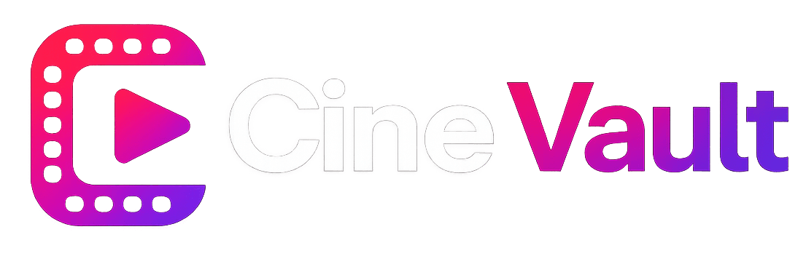
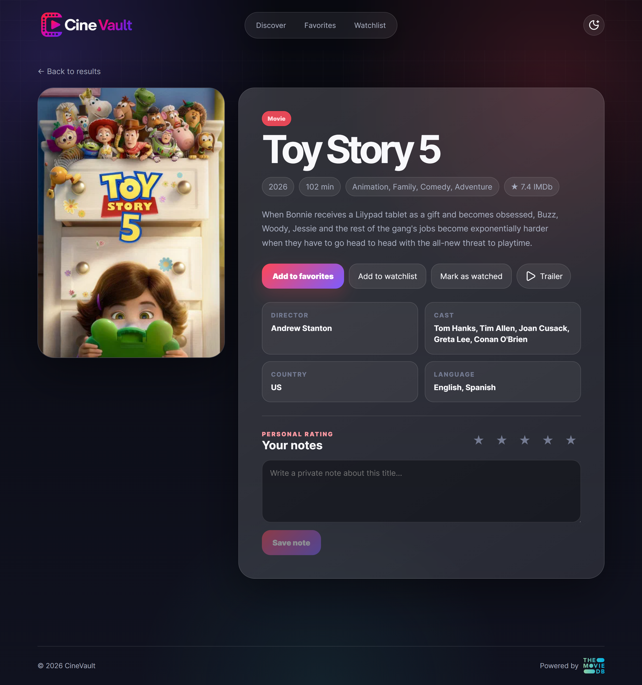

<p align="center">
  
</p>

<h1 align="center">CineVault</h1>

<p align="center">
A movie tracking app built with Vanilla JavaScript using the MVC architecture and powered by the TMDB API.
</p>

---

## Live Demo

👉 https://cine-vault-flax-one.vercel.app/

---

## Overview

CineVault is a responsive web application where you can discover movies, save your favorites, build a watchlist, and keep track of what you've watched.

The project was built using Vanilla JavaScript and follows the MVC architecture to keep the code organized, modular, and easy to maintain. It also focuses on delivering a smooth and responsive user experience.

---

## Features

- Search movies by title
- Browse popular movies
- View detailed movie information
- Watch official trailers
- Save favorite movies
- Create and manage a watchlist
- Mark movies as watched
- Rate movies
- Add personal notes
- Light and Dark theme
- Lazy image loading
- Skeleton loading screens
- Toast notifications
- Responsive design
- LocalStorage persistence
- Error handling with a custom 404 page

---

## Tech Stack

- HTML5
- CSS3
- JavaScript (ES6)
- TMDB API
- Lucide Icons

---

## Technical Highlights

- MVC Architecture
- ES6 Modules
- REST API Integration
- LocalStorage Persistence
- Responsive Layout
- Lazy Loading
- Skeleton Loading
- Theme Persistence
- Modular Code Organization

---

## Project Structure

```text
CineVault
│
├── assets/
├── css/
├── js/
│   ├── controllers/
│   ├── models/
│   ├── views/
│   ├── utils/
│   ├── app.js
│   └── config.js
│
├── index.html
├── details.html
├── favorites.html
├── watchlist.html
├── 404.html
└── README.md
```

---

## Screenshots

### Home


### Movie Details



### Favorites


### Watchlist


---

## Getting Started

Clone the repository:

```bash
git clone https://github.com/RicardoMartins07/CineVault.git
```

Go to the project folder:

```bash
cd CineVault
```

Then open the project using Live Server (or any static web server of your choice).

---

## TMDB API

This project uses data provided by **The Movie Database (TMDB)**.

https://developer.themoviedb.org/

This product uses the TMDB API but is not endorsed or certified by TMDB.

---

## About the API Key

Since CineVault is a front-end-only application, all requests to the TMDB API are made directly from the browser.

As a result, the API key is included in the client-side code. This is a common limitation when working with public APIs in static applications.

For a production-ready application, these requests should be handled by a backend or serverless functions (such as Vercel Functions, Express, or Node.js) to keep API credentials secure.

---

## License

This project is licensed under the MIT License.
